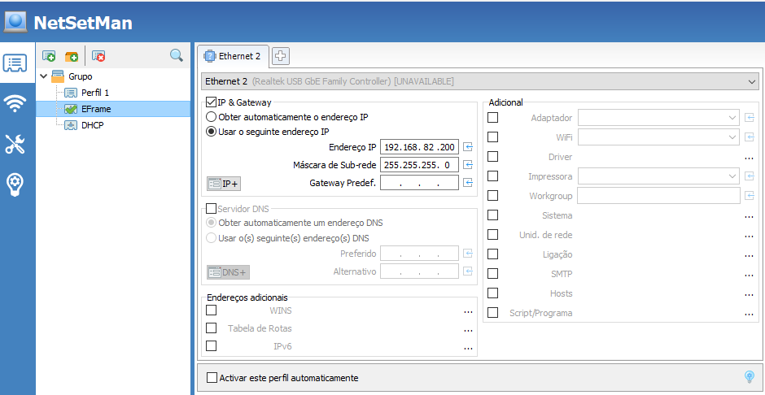
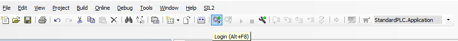

# E-Frame-SUZUKI
Código desarrollado en [Codesys](https://www.codesys.com/) para el funcionamiento del E-Frame de Suzuki.

## Branches existentes
En el proyecto existen 3 branches distintas:
- **master**: branch que contiene la versión más estable del código;
- **dev**: branch que contiene el código que está pendiente de ser probado en el E-Frame.

Las otras branches presentes corresponden a los distintos pasos del desarrollo para llegar al resultado final. Cada branch contiene el nombre de la funcionalidad en estudio.

## Instalación
Para que sea posible la abertura de los archivos de código es necesaria la instalación de Codesys, un *software* gratuito de programación de PLCs. 

El PLC utilizado en el proyecto es el [CR711S](https://www.ifm.com/pt/pt/product/CR711S) de IFM, siendo necesaria la instalación de algunas librerías para la correcta programación del PLC. Estos archivos pueden ser encontrados en la carpeta **Instaladores CODESYS**. 

La carpeta **Instaladores CODESYS** se encuentra dividida en las siguientes carpetas:
-	\Instaladores CODESYS\Setup Codesys: *setup* de instalación del codesys;
-	\Instaladores CODESYS\Librerias\Codesys V3.5 SP11: librerías de ifm;
-	\Instaladores CODESYS\Librerias\Encoder de hilo: archivo .eds para la comunicación CANopen con el encoder de hilo.

El primer paso para dar es la instalación del *software* Codesys. Para eso, es necesario acceder a la carpeta que contiene el *setup* de instalación y proceder a su instalación. 

Una vez instalado el Codesys, es necesario hacer la instalación de las librerías de ifm. Para eso, es necesario acceder a la carpeta de librería y hacer la instalación de todas las librerías presentes (no es necesario abrir Codesys para este paso, se puede pulsar dos veces en cima del archivo de la librería que la misma va a ser instalada). 

Por ultimo es necesario añadir el archivo .eds al Codesys para que sea posible la comunicación CANopen con el encoder de hilo utilizado en el proyecto. Para este paso, es necesario tener Codesys abierto y hacer los siguientes pasos: 
&emsp; &emsp; &emsp; &emsp; &emsp; &emsp; &emsp; &emsp; &emsp; &emsp; &emsp; *Tools/ Device Repository… / Install / Selecionar el archivo eds / close*

## Envio del código al PLC
El envío del código entre Codesys y el PLC se hace utilizando el protocolo de comunicación Ethernet. 

Para garantizar que la conexión y el envio del código es hecha correctamente, es necesario tener en cuenta los siguientes puntos:
-	Tener el cable de programación correctamente conectado al ordenador y al PLC;
-	Verificar el IP del ordenador (por *default*, los PLCs viene con el IP 192.168.82.247. Es necesario cambiar el IP del ordenador a 192.168.82.200, con recurso al [NetSetMan](https://www.netsetman.com/pt/freeware));

-	Abrir el proyecto en Codesys y hacer duplo click en el dispositivo **CR711S (CR711S)**. Se abre una nueva ventana donde aparecen las definiciones del dispositivo. Luego en la primera pestaña **Communication Settings** es necesario iniciar una búsqueda por el dispositivo. Así que sea encontrado, duplo clique en el IP que va a aparecer;

-	Hacer el *login* y, si necesario, transferir el código al PLC. 

 

Después de enviar código al PLC, es necesario hacer el *logout* del PLC en Codesys, apagar y encender el PLC (no es necesário desconectar el PLC del ordenador).

## Releases
v27:
- Anomalía 22 comentada
- Actualización del timer del láser para 3 segundos 
