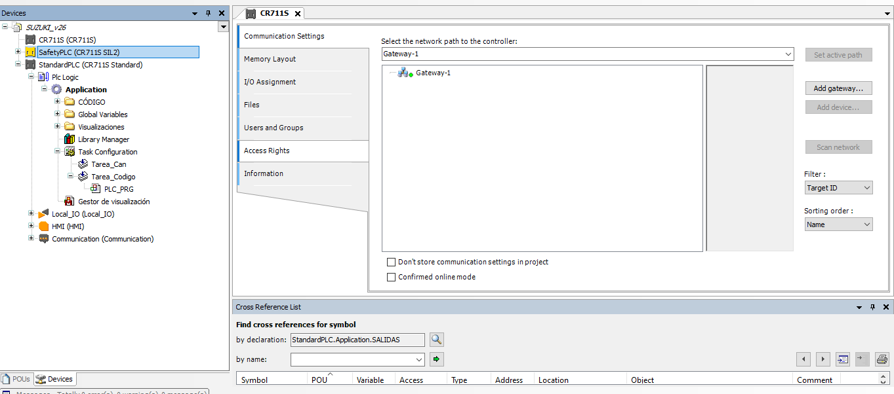

# E-Frame-SUZUKI

Código desarrollado en [Codesys](https://www.codesys.com/) para el funcionamiento del E-Frame de Suzuki.

## Branches existentes

En el proyecto existen 3 branches distintas:

- **master**: branch que contiene la versión más estable del código;
- **dev**: branch que contiene el código que está pendiente de ser probado en el E-Frame.

Las otras branches presentes corresponden a los distintos pasos del desarrollo para llegar al resultado final. Cada branch contiene el nombre de la funcionalidad en estudio.

## Instalación

Para que sea posible la abertura de los archivos de código es necesaria la instalación de Codesys, un _software_ gratuito de programación de PLCs. 

El PLC utilizado en el proyecto es el [CR711S](https://www.ifm.com/pt/pt/product/CR711S) de IFM, siendo necesaria la instalación de algunas librerías para la correcta programación del PLC. Estos archivos pueden ser encontrados en la carpeta **Instaladores CODESYS**. 

La carpeta **Instaladores CODESYS** se encuentra dividida en las siguientes carpetas:

- \Instaladores CODESYS\Setup Codesys: _setup_ de instalación del codesys;
- \Instaladores CODESYS\Librerias\Codesys V3.5 SP11: librerías de ifm;
- \Instaladores CODESYS\Librerias\Encoder de hilo: archivo .eds para la comunicación CANopen con el encoder de hilo.

El primer paso para dar es la instalación del _software_ Codesys. Para eso, es necesario acceder a la carpeta que contiene el _setup_ de instalación y proceder a su instalación. 

Una vez instalado el Codesys, es necesario hacer la instalación de las librerías de ifm. Para eso, es necesario acceder a la carpeta de librería y hacer la instalación de todas las librerías presentes (no es necesario abrir Codesys para este paso, se puede pulsar dos veces en cima del archivo de la librería que la misma va a ser instalada). 

Por ultimo es necesario añadir el archivo .eds al Codesys para que sea posible la comunicación CANopen con el encoder de hilo utilizado en el proyecto. Para este paso, es necesario tener Codesys abierto y hacer los siguientes pasos: 
&emsp; &emsp; &emsp; &emsp; &emsp; &emsp; &emsp; &emsp; &emsp; &emsp; &emsp; _Tools/ Device Repository… / Install / Selecionar el archivo eds / close_

## Envio del código al PLC

El envío del código entre Codesys y el PLC se hace utilizando el protocolo de comunicación Ethernet. 

Para garantizar que la conexión y el envio del código es hecha correctamente, es necesario tener en cuenta los siguientes puntos:

- Tener el cable de programación correctamente conectado al ordenador y al PLC;
- Verificar el IP del ordenador (por _default_, los PLCs viene con el IP 192.168.82.247. Es necesario cambiar el IP del ordenador a 192.168.82.200, con recurso al [NetSetMan](https://www.netsetman.com/pt/freeware));
  
- Abrir el proyecto en Codesys y hacer duplo click en el dispositivo **CR711S (CR711S)**. Se abre una nueva ventana donde aparecen las definiciones del dispositivo. Luego en la primera pestaña **Communication Settings** es necesario iniciar una búsqueda por el dispositivo. Así que sea encontrado, duplo clique en el IP que va a aparecer;
  
- Hacer el _login_ y, si necesario, transferir el código al PLC. 
  
   

Después de enviar código al PLC, es necesario hacer el _logout_ del PLC en Codesys, apagar y encender el PLC (no es necesário desconectar el PLC del ordenador).

## Releases

v27:

- Anomalía 22 comentada
- Actualización del timer del láser para 3 segundos

v28:

- Alteración de los campos láser
- Definición del campo láser en el control automático. Esta definición tiene la diferencia entre extensión con y sin carga y si el E-Frame tiene 1600 o 1800 de anchura

v29:

- Cuando se pulsa seta o el E-Frame esta en modo manual, el campo láser es cambiado para Bumper;
- En el control automático, se mira las entradas OSSD del láser para garantizar que no existe objecto y es seguro el cambio del campo láser;
- Adición de excepciones al código del campo láser para que informe anomalía de detección de objetos en caso de que el brazo esté parado pero con orden de carga o descarga.

v30:

- En M_Parar, si el E-Frame es cambiado al modo automático, la acción del brazo es cambiada a A_Parar.

v31:

- El láser solo detecta en caso de que haya recibido una orden;
- Reseteo de la orden de carga/descarga cuando se pulsa seta y cuando se entra en modo manual;
- Adición del reseteo de las ordenes, OPT=indeterminado siempre que termina la operación y llamada a la función ESTADOS() para actualizar el estado de las ordenes (control automático);
- Corrección de la anomalía 20 en la función ESTADOS() (gCargaOPT=indeterminado);
- Forzar la acción del brazo como A_Parar cuando el E-Frame se encuentra en estado reposo (ESTADOS());
- Cambio de los valores del offset del encoder para la detención del inductivo extendido y recogido.

v32:

- Adición de un timer para el control de la baliza y del buzzer en modo automatico.

v33:

- Descomento de las anomalías 19 y 22;
- Revisión de las anomalías 20 y 35.

v34:

- Corrección de las anomalías 19, 21 y 22;
- Limpieza de los comentarios desnecesarios del código.

v35:

- Corrección de la anomalía 35.

v35b:

- la versión del código es la 35 pero fueron arreglados los comentarios en todo el código;

El_Eframe_SUZUKI_ASTI_16032022:

- Es la misma versión que la v35b. Solo que quede anotado que esta fue la versión de los E-Frames de ASTI y SUZUKI.

v36:

- Corrección de la anomalía 22;
- Este código corresponde al .zip El_Eframe_SUZUKI_ASTI_22032022.
